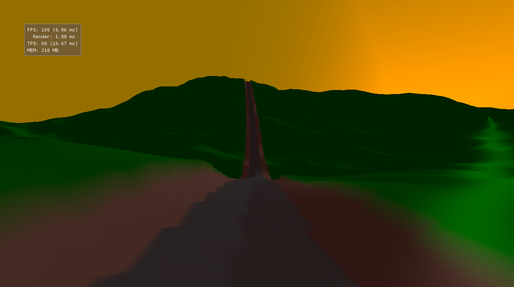

# drive

Procedural terrain experiment.



## Running

### Linux

Dependencies: Meson, gcc, glslc

```sh
git clone https://github.com/laurirasanen/drive.git --recursive
cd drive
./setup_release.sh
./run.sh
```

### Windows

Dependencies: Meson, Visul Studio 2022, Vulkan SDK

```sh
git clone https://github.com/laurirasanen/drive.git --recursive
cd drive
meson setup -Dcpp_std=c++latest build
cd drive
meson compile
./drive.exe
```

## Third-party code

- [glm](https://github.com/g-truc/glm): MIT / The Happy Bunny License
- [imgui](https://github.com/ocornut/imgui): MIT License
- [VulkanMemoryAllocator](https://github.com/GPUOpen-LibrariesAndSDKs/VulkanMemoryAllocator): MIT License
- [PerlinNoise](https://github.com/Reputeless/PerlinNoise): MIT License
- [SDL](https://github.com/libsdl-org/SDL) (system/wrapdb): Zlib License
- [Vulkan-Headers](https://github.com/KhronosGroup/Vulkan-Headers) (system/wrapdb): Apache-2.0 / MIT License

